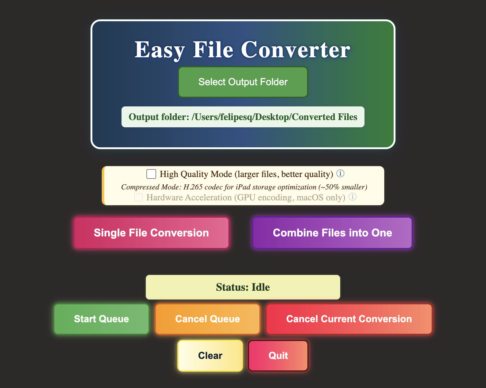

# Easy File Converter

A macOS desktop app for converting and merging video files, built with Electron and FFmpeg.

I built this to solve a specific problem: getting large `.mov` recordings off a Mac and onto an iPad without filling up the device. The default mode re-encodes to H.265 at roughly half the original file size; a high-quality H.264 mode is a checkbox away when compatibility matters more than storage.

<!-- Add a screenshot here once captured:  -->

## Features

- **Single-file conversion** — select one or many files; they convert sequentially to keep CPU and disk load predictable
- **Combine mode** — merge multiple clips into one output file, with a manual-start job queue so large batches don't kick off automatically
- **Two encoding profiles**
  - _Compressed_ (default): H.265 / `libx265`, CRF 26 — roughly 50% smaller files
  - _High Quality_: H.264 / `libx264`, CRF 22 — broader device compatibility
- **Optional hardware acceleration** — VideoToolbox GPU encoding on Apple Silicon, with automatic fallback to CPU if the hardware encoder fails
- **Fast remux path** — inputs already in a compatible MP4/H.264/AAC form are stream-copied instead of re-encoded
- **Automatic downscaling** — anything above 720p is scaled to 1280×720 with aspect-preserving padding
- **Per-dialog folder memory** — input, combine, and output directories are each remembered separately between sessions
- **Live progress** — per-file and overall percentages, throttled to 500 ms to avoid flooding the UI
- **Cancellable** — stop an in-flight conversion or clear the pending combine queue

## Requirements

- macOS on Apple Silicon (`arm64`)
- Node.js 18+
- FFmpeg and FFprobe

## Setup

```bash
git clone https://github.com/felipe-sq/easy-file-converter.git
cd easy-file-converter
npm install
```

FFmpeg binaries are **not** committed to this repo. Install FFmpeg and place `ffmpeg` and `ffprobe` in `bin/`:

```bash
brew install ffmpeg
mkdir -p bin
cp "$(which ffmpeg)" "$(which ffprobe)" bin/
```

At startup, `converter.js` resolves the binaries from `bin/`, falling back to the unpacked resources directory when running as a packaged app. If neither is found, `fluent-ffmpeg` falls back to whatever `ffmpeg` is on your `PATH`.

## Running

```bash
npm run dev     # opens with DevTools
npm start       # production mode
```

## Building a macOS app

```bash
npm run package-mac
```

The packaged `.app` lands in `Easy-File-Converter-darwin-arm64/`. `bin/` is excluded from the ASAR archive (`--asar.unpackDir=bin`) so the FFmpeg binaries remain executable at runtime.

For distribution outside your own machine, the app would also need to be code-signed and notarized by Apple.

## Architecture

| File           | Responsibility                                                                                          |
| -------------- | ------------------------------------------------------------------------------------------------------- |
| `main.js`      | Electron main process — window lifecycle, native file dialogs, conversion and combine queues, settings  |
| `converter.js` | FFmpeg orchestration — encoder profile selection, remux eligibility, scaling, concat, hardware fallback |
| `preload.js`   | Context-isolated IPC bridge; the renderer gets an explicit allowlist of channels and nothing else       |
| `renderer.js`  | UI state — progress, queue status, buttons, quality toggles                                             |
| `index.html`   | Markup and Content Security Policy                                                                      |
| `styles.css`   | Styling                                                                                                 |

**Security posture:** the renderer runs with `contextIsolation: true`, `nodeIntegration: false`, and a restrictive CSP. All privileged work happens in the main process behind the `preload.js` bridge.

**Combine strategy:** if every input is already MP4/H.264/AAC and no scaling is needed, files are concatenated with a straight stream copy. Otherwise each input is transcoded to an intermediate MPEG-TS segment in the OS temp directory, concatenated, and the temp directory is removed on success or failure.

**Settings:** user preferences (output folder, remembered directories, quality mode, hardware acceleration) persist to `~/.mov2mp4_settings.json`.

## Known limitations

- Apple Silicon only. There's no Intel or universal build, and no Windows/Linux support — the hardware acceleration path is VideoToolbox-specific.
- Homebrew's FFmpeg is dynamically linked against libraries in `/opt/homebrew/Cellar/`, so a packaged app built with those binaries won't run on a Mac that doesn't have the matching FFmpeg installed. A static FFmpeg build would be needed for true standalone distribution.
- No automated test suite; conversion paths were verified manually.

## License

[MIT](LICENSE) © Felipe Slaughter-Quintero

This project calls FFmpeg as an external binary but does not bundle or redistribute it. FFmpeg is licensed separately under the [LGPL-2.1+ / GPL-2+](https://ffmpeg.org/legal.html), depending on how it was built.
